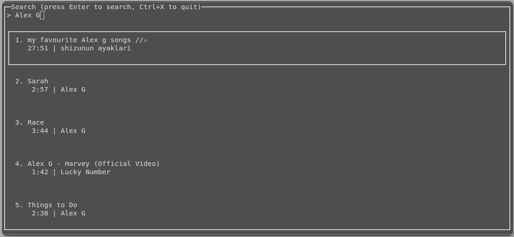

# yuzutube
a TUI software based on youtube_search and yt-dlp python modules (and cJSON, ncurses libraries) for Linux



## Installation
### Installing python, cjson, ncurses
Firstly you have to install python, cjson, ncurses, clang(or gcc) from your package manager
for pacman it's:
```
sudo pacman -Syu python cjson ncurses clang
```
if you're having issues with installation, please report in "Issues"
### Installing python modules
Ensure that you have pip modules youtube_search, yt_dlp, argparse
```
# Creating and entering venv (to quit enter 'deactivate')
python -m venv ~/venv
source ~/venv/bin/activate

# Installing modules
pip install youtube_search yt_dlp argparse

# Set a PYTHONPATH environmental (needed when running a compiled software)
# also, it will be unset after exiting your shell, to set it the permanently write this command to your .bashrc/.zshrc (depends on shell)
export PYTHONPATH=$HOME/venv/lib/python3.13/site-packages
# (may be different dir in your venv)
```
### Copying git repo and installing with make
Also make sure you have git installed (from your package manager)
```
git clone https://github.com/itrocaiks/yuzutube
cd yuzutube

# Compiling and installing with make
make
make clean
make install
# If you want to uninstall run 'make uninstall'
```

## Configuration
### Setting envs
you have to set next environmental variables:
```
# optional, limit for results, default: 10
export YUZU_MAX_LIMIT=20

# optional, default: '$HOME/.config/yuzutube', if you ran 'make install', your config path is '$HOME/.config/yuzutube'
export YUZU_CONFIG_PATH=<your_config_path_here>

# optional, default: '$PWD' (this directory), dir where your downloaded media will be stored
export YUZU_DOWNLOAD_DIR=<your_download_dir_here>

# required if not running in venv, dir depends on your venv
export PYTHONPATH=$HOME/venv/lib/python3.13/site-packages 
```
!!! NOTICE THAT ALL THESE ENVIRONMENTAL VARIABLES WILL BE UNSET AFTER EXITING !!!
####
(to set it the permanently write these commands to your .bashrc/.zshrc (depends on shell))

### Getting cookies.txt
you will have to get your youtube cookies (use chrome extension for it: https://chromewebstore.google.com/search/cookies.txt)
```
# After getting cookies file, copy it to conf dir:
cp <your_cookie_file> $HOME/.config/yuzutube/conf/cookies.txt
# if you set YUZU_CONFIG_PATH:
cp <your_cookie_file> $YUZU_CONFIG_PATH/conf/cookies.txt
```

## Runing yuzutube
after installing and configuring everything just as it was said here, run the software with:
```
yuzutube
```
the interface is user-friendly, to quit from searching line, press Ctrl+x, to quit from anywhere, press Ctrl+c<br>
to search, select video or format press Enter from coresponding window<br>
to interrupt download or get back to inputting press 'q'

## Afterwords
i've been making this TUI for 19 hours/day, i got a headache, and it's not very likely that I'd maintain this software any furtherr<br>
but it would be nice if you report something in issues, i'll try to help you as soon as i receive the notification :3


